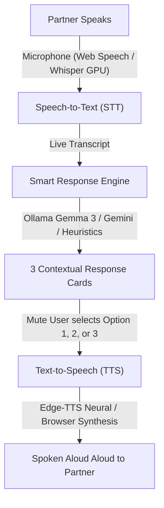

# 🎙️ Vocalis AAC - Real-Time Voice Communication Assistant

**Vocalis AAC** is an assistive speech application designed specifically for mute and non-verbal individuals to engage in natural, real-time spoken conversations.

---

## ⚡ How It Works



1. **Ambient Listening (Speech-to-Text)**:
   - The conversational partner speaks naturally.
   - Captured in real-time via Web Speech API with interim typing results or local GPU Whisper (`/api/transcribe`).
   - Live visual audio meter indicates incoming speech.

2. **3 Contextual Smart Suggestions**:
   - The app instantly generates 3 natural, first-person replies matching different conversational intents:
     - **Option 1**: Affirmative / Enthusiastic / Agree
     - **Option 2**: Inquiry / Alternative / Thoughtful
     - **Option 3**: Polite Decline / Boundary / Pass
   - Powered locally by **Ollama (`gemma3:4b`)**, with instant heuristic fallback (0ms) and optional **Google Gemini** cloud support.

3. **Single-Tap or Hotkey Selection & TTS**:
   - The user selects an option by tapping the card or pressing keyboard keys **`1`**, **`2`**, or **`3`**.
   - The app immediately speaks the chosen phrase out loud using **Neural Edge-TTS** (human studio voices) or **Browser Web SpeechSynthesis**.
   - Active "Speaking..." badge shows the user and listener that speech is underway.

4. **AAC Essentials**:
   - **Quick Emergency & Status Pills**: *"Please give me a moment, I am using a speech device"*, *"Yes"*, *"No"*, *"Thank you"*, *"Could you please repeat that?"*.
   - **Type-to-Speak**: Freeform text input with instant speech synthesis.
   - **Interactive Dialogue History**: Replay past statements anytime if someone didn't catch what you said.

---

## 🚀 Quick Start

To launch both the backend and frontend with a single command:

```bash
./run.sh
```

- **Frontend Application**: [http://localhost:5173](http://localhost:5173) (or [http://localhost:8000](http://localhost:8000))
- **Backend API Docs**: [http://localhost:8000/docs](http://localhost:8000/docs)

---

## 🛠️ Architecture & Technologies

- **Frontend**:
  - React 19 + Vite 8
  - Tailwind CSS
  - Lucide Icons
  - Web Speech API (`SpeechRecognition` & `SpeechSynthesis`)
  - Web Audio API (real-time frequency visualizer)
- **Backend**:
  - FastAPI + Uvicorn
  - PyTorch CUDA GPU acceleration
  - OpenAI Whisper (local automatic speech recognition)
  - Edge-TTS (studio-quality neural voice synthesis)
  - Ollama client (local Gemma 3 4B)
  - Google Gemini API client (optional cloud boost)
  - Qwen3-TTS voice cloning using a saved local voice profile

### Using the cloned Qwen voice

Vocalis automatically looks for the existing profile at
`../qwen3-tts-runtime/saved_voice.pt`. Run the backend with the Qwen runtime so
the model package and GPU dependencies are available:

```bash
../qwen3-tts-runtime/.venv/bin/python -m uvicorn backend.app:app --host 0.0.0.0 --port 8000
```

Choose **Mi voz clonada (Qwen3-TTS)** in Vocalis settings. The model loads on
server startup; Edge-TTS and browser voices remain available as fallbacks. The
fast 0.6B Base checkpoint is used by default. Set `QWEN_TTS_MODEL=quality` for
the 1.7B checkpoint, or use `fast`, `0.6b`, `1.7b`, or a full Hugging Face model
ID. Set `QWEN_VOICE_PROFILE` if the profile is stored elsewhere.

Profiles saved by the 1.7B model are adapted automatically for 0.6B by decoding
their saved reference speech codes and re-extracting the correctly sized speaker
embedding. The original profile is never overwritten.

The settings panel can record or upload a new 8–15 second voice sample. Vocalis
uses Qwen's speaker-embedding mode, so the user does not need to type a
transcript. Choosing **Crear y usar esta voz** intentionally replaces the active
saved profile after the user confirms consent.

For GPU attention, `QWEN_TTS_ATTENTION=auto` prefers FlashAttention 2 when the
`flash-attn` package is installed and otherwise uses Qwen's eager path. To install
FlashAttention in an environment with the CUDA development toolkit (`nvcc`):

```bash
MAX_JOBS=4 uv pip install --python ../qwen3-tts-runtime/.venv/bin/python \
  flash-attn --no-build-isolation
```

The current `qwen-tts` Python generation API returns a complete waveform rather
than incremental audio chunks. Consequently, Vocalis cannot begin cloned-voice
playback mid-generation without a different streaming inference backend. The
HTTP response itself is inexpensive; model generation dominates the wait.

---

## ⚙️ Configuration & Customization

Open the **Settings** modal in the top right to customize:
- **Voice Provider**: Switch between Browser System Voices and Neural Edge-TTS voices (Guy, Jenny, Aria, Christopher, Ryan, Sonia, etc.).
- **Voice Rate & Pitch**: Fine-tune speed and pitch with a live "Test Voice" preview.
- **AI Tone**: Natural, Casual & Friendly, Professional, Concise (1-3 words), or Warm & Empathetic.
- **AI Engine**: Auto, Local Ollama Gemma 3, Cloud Gemini, or Instant Heuristic.
- **STT Engine**: Auto (Web Speech with Whisper fallback) or Dedicated Whisper GPU.
### Optional low-latency cloned voice

Vocalis can keep the original whole-WAV Qwen engine and run a second, isolated
CUDA-graph engine that streams PCM while it generates. The UI exposes both in
**Ajustes → Motor de la voz clonada** and defaults to the original engine.

The streaming environment lives beside this repository so its Qwen and
Transformers versions cannot replace the standard runtime:

```bash
git clone https://github.com/andimarafioti/faster-qwen3-tts.git ../faster-qwen3-tts
uv venv --python 3.12 ../faster-qwen3-tts/.venv
uv pip install --python ../faster-qwen3-tts/.venv/bin/python \
  -e '../faster-qwen3-tts[demo]' 'transformers==5.15.1'
```

`run.sh` detects that environment and starts the private worker on
`127.0.0.1:8002`. Both engines read the same device-scoped cloned voice files;
the worker is never exposed directly through Tailscale.
