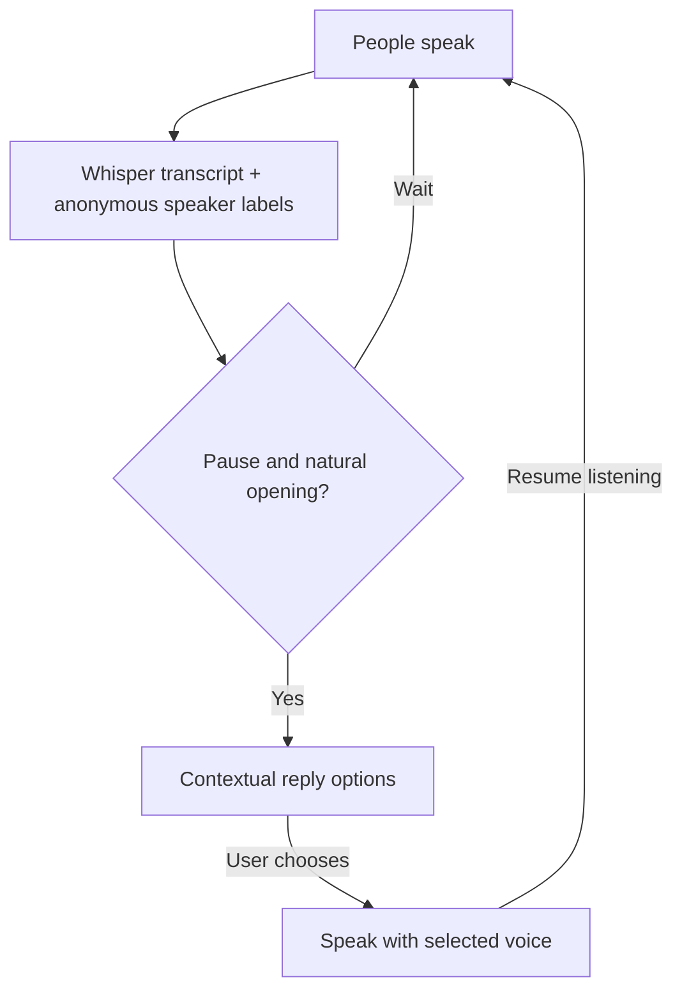

# Vercel deployment

The Gemini 3.8 Flash and password protected Vercel setup is documented in [DEPLOY.md](DEPLOY.md). The details below describe the older local Qwen setup.

Both deployments support continuous conversation listening, topic anchors, personal context, transcript visibility, and adjacent Sí/No replies. The Vercel API uses public Groq suggestions and transcription while retaining login for paid Gemini inference. Its build sets `VITE_SPEAKER_LABELS=false`: transcripts appear without speaker badges or speaker-identification notices, and history distinguishes **Tú** from **Conversación**. Speaker estimates remain available in local builds using the backend's Resemblyzer encoder and FFmpeg. Hosted API regression tests: `python -m unittest backend.test_hosted_conversation`.

# 🎙️ Vocalis AAC - Real-Time Voice Communication Assistant

**Vocalis AAC** is an assistive speech application designed specifically for mute and non-verbal individuals to engage in natural, real-time spoken conversations.

---

## ⚡ How It Works


```mermaid
graph TD
    A["People speak"] --> B["Whisper transcript + anonymous speaker labels"]
    B --> C{"Pause and natural opening?"}
    C -->|"Wait"| A
    C -->|"Yes"| D["Contextual reply options"]
    D -->|"User chooses"| E["Speak with selected voice"]
    E -->|"Resume listening"| A
```

1. **Continuous conversation listening**:
   - In conversation mode, audio is captured continuously until stopped, with a live microphone meter.
   - Each pause (default 1 second) closes an audio recording; uninterrupted speech is split at 12 seconds. Recordings are transcribed in order with Groq `whisper-large-v3-turbo`, or local Whisper `tiny` if no Groq key is configured. This is transcription of completed chunks, not streaming word-by-word Whisper.
   - Local Resemblyzer voice embeddings, clustered and aligned with Whisper word timestamps, estimate anonymous **Persona 1 / Persona 2** labels across recordings. No enrollment or additional cloud provider is needed. Short, ambiguous, and overlapping speech may remain unidentified or be mislabeled; labels are not verified identities.
   - Browser live-text mode remains available, but cannot distinguish speakers.

2. **Suggestions at conversational openings**:
   - After speech stops and pending transcriptions finish, Groq considers the last 16 speaker-labeled turns, including the AAC user's own selected messages.
   - It offers replies for questions, invitations, and natural openings, and can wait during incomplete thoughts, exchanges between other speakers, or already-answered questions. These are model judgments, not guaranteed turn detection.
   - New speech cancels obsolete suggestion requests. Suggestions never speak automatically. The user can request replies manually with **Otras respuestas** or enter a message themselves.
   - Automatic turn assessment requires the existing Groq key. If unavailable, the app shows a status instead of unrelated automatic replies; manual suggestions retain the selected engine and existing fallbacks.
   - Listening pauses during the app's voice playback and resumes afterward. An explicit **Detener escucha** stays stopped. A slow connection pauses capture if the transcription queue fills.

Voice embeddings are kept only in server memory, isolated by a random conversation session (up to 100 sessions, 30-minute idle expiry, at most eight speaker profiles). Clearing history or reloading starts fresh speaker labels. Transcript history remains in the browser as before; recorded audio is sent to Groq for transcription when configured, and its temporary server file is deleted afterward. Conversation context is sent to Groq for automatic turn assessment.

The speaker encoder and its bundled weights install with `backend/requirements.txt`; FFmpeg must be available. Tests: `python -m unittest backend.test_conversation`; frontend: `node --test tests/*.test.js`. The browser regression test `frontend/tests/conversation.browser.cjs` uses Playwright and a running built app; set `PLAYWRIGHT_MODULE` if Playwright is installed elsewhere and optionally `VOCALIS_TEST_URL`. Use Node 22+ for the current frontend toolchain.

3. **Single-Tap or Hotkey Selection & TTS**:
   - The user selects an option by tapping the card or pressing keyboard keys **`1`**, **`2`**, or **`3`**.
   - The app immediately speaks the chosen phrase out loud using **Neural Edge-TTS** (human studio voices) or **Browser Web SpeechSynthesis**.
   - Active "Speaking..." badge shows the user and listener that speech is underway.

4. **AAC Essentials**:
   - **Quick Emergency & Status Pills**: *"Please give me a moment, I am using a speech device"*, *"Yes"*, *"No"*, *"Thank you"*, *"Could you please repeat that?"*.
   - **Type-to-Speak**: Freeform text input with instant speech synthesis.
   - **Interactive Dialogue History**: Replay past statements anytime if someone didn't catch what you said.

---

## 🚀 Quick Start

To launch both the backend and frontend with a single command:

```bash
./run.sh
```

- **Frontend Application**: [http://localhost:5173](http://localhost:5173) (or [http://localhost:8000](http://localhost:8000))
- **Backend API Docs**: [http://localhost:8000/docs](http://localhost:8000/docs)

---

## 🛠️ Architecture & Technologies

- **Frontend**:
  - React 19 + Vite 8
  - Tailwind CSS
  - Lucide Icons
  - Web Speech API (`SpeechRecognition` & `SpeechSynthesis`)
  - Web Audio API (real-time frequency visualizer)
- **Backend**:
  - FastAPI + Uvicorn
  - PyTorch CUDA GPU acceleration
  - OpenAI Whisper (local automatic speech recognition)
  - Edge-TTS (studio-quality neural voice synthesis)
  - Ollama client (local Gemma 3 4B)
  - Google Gemini API client (optional cloud boost)
  - Qwen3-TTS voice cloning using a saved local voice profile

### Using the cloned Qwen voice

Vocalis automatically looks for the existing profile at
`../qwen3-tts-runtime/saved_voice.pt`. Run the backend with the Qwen runtime so
the model package and GPU dependencies are available:

```bash
../qwen3-tts-runtime/.venv/bin/python -m uvicorn backend.app:app --host 0.0.0.0 --port 8000
```

Choose **Mi voz clonada (Qwen3-TTS)** in Vocalis settings. The model loads on
server startup; Edge-TTS and browser voices remain available as fallbacks. The
fast 0.6B Base checkpoint is used by default. Set `QWEN_TTS_MODEL=quality` for
the 1.7B checkpoint, or use `fast`, `0.6b`, `1.7b`, or a full Hugging Face model
ID. Set `QWEN_VOICE_PROFILE` if the profile is stored elsewhere.

Profiles saved by the 1.7B model are adapted automatically for 0.6B by decoding
their saved reference speech codes and re-extracting the correctly sized speaker
embedding. The original profile is never overwritten.

The settings panel can record or upload a new voice sample. Recording stops
automatically after 15 seconds; 8–15 seconds is recommended, and samples must
be 6–30 seconds long. Vocalis uses Qwen's speaker-embedding mode, so the user
does not need to type a transcript. One saved profile is shared by the standard
and streaming modes. Choosing **Crear y usar esta voz** replaces the active
saved profile after the user confirms consent.

Completed phrases are kept in a bounded in-memory audio cache for immediate
replay in the same tab. The cache covers both Qwen modes and Edge-TTS, and is
cleared when a new voice profile is created. Reloading the page starts a fresh
cache; browser system voices continue to use the browser's own synthesis.

For the AAC board, tapping a pictogram adds and speaks that segment. This can be
turned off in voice settings. **Hablar** always speaks the whole composed
sentence as one utterance. Voice settings offer two preparation choices:
frequent phrases, or the full board (including unique tile texts, custom quick
phrases, and saved phrases). Clips are generated one at a time and saved on this
device for fast playback after a reload. A full-board pass can take a long time;
progress is shown, it can be stopped and resumed, and preparation stops when
the user starts speaking. Available device storage may limit how many clips
can be kept. A new cloned voice clears the saved clips.

For GPU attention, `QWEN_TTS_ATTENTION=auto` prefers FlashAttention 2 when the
`flash-attn` package is installed and otherwise uses Qwen's eager path. To install
FlashAttention in an environment with the CUDA development toolkit (`nvcc`):

```bash
MAX_JOBS=4 uv pip install --python ../qwen3-tts-runtime/.venv/bin/python \
  flash-attn --no-build-isolation
```

The current `qwen-tts` Python generation API returns a complete waveform rather
than incremental audio chunks. Consequently, Vocalis cannot begin cloned-voice
playback mid-generation without a different streaming inference backend. The
HTTP response itself is inexpensive; model generation dominates the wait.

---

## ⚙️ Configuration & Customization

Open the **Settings** modal in the top right to customize:
- **Voice Provider**: Switch between Browser System Voices and Neural Edge-TTS voices (Guy, Jenny, Aria, Christopher, Ryan, Sonia, etc.).
- **Voice Rate & Pitch**: Fine-tune speed and pitch with a live "Test Voice" preview.
- **AI Tone**: Natural, Casual & Friendly, Professional, Concise (1-3 words), or Warm & Empathetic.
- **AI Engine**: Auto, Local Ollama Gemma 3, Cloud Gemini, or Instant Heuristic.
- **STT Engine**: Conversation listening (Whisper plus local speaker estimates) or browser live text (without speaker labels).
### Optional low-latency cloned voice

Vocalis can keep the original whole-WAV Qwen engine and run a second, isolated
CUDA-graph engine that streams PCM while it generates. The UI exposes both in
**Ajustes → Motor de la voz clonada** and defaults to the original engine.

The streaming environment lives beside this repository so its Qwen and
Transformers versions cannot replace the standard runtime:

```bash
git clone https://github.com/andimarafioti/faster-qwen3-tts.git ../faster-qwen3-tts
uv venv --python 3.12 ../faster-qwen3-tts/.venv
uv pip install --python ../faster-qwen3-tts/.venv/bin/python \
  -e '../faster-qwen3-tts[demo]' 'transformers==5.15.1'
```

`run.sh` detects that environment and starts the private worker on
`127.0.0.1:8002`. Both engines read the same device-scoped cloned voice files;
the worker is never exposed directly through Tailscale.
